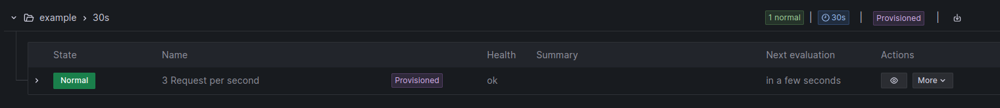
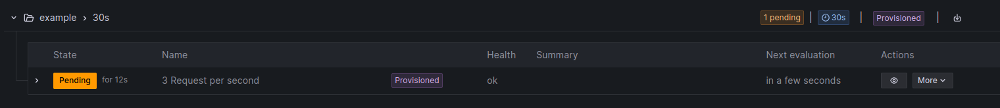
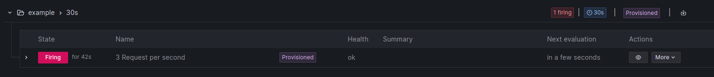

# ECS Prometheus Monitoring

## Working Example

The initial deployment of the ECS was modified to enable the local execution of the production mode without the need of a DNS server. Due to the absence of a DNS server, certain components of the mail software were stripped down. As a result, all emails are logged instead of being sent via a mailserver.

The motivation behind this project is rooted in the implementation of Infrastructure as Code (IaC) principles, specifically embracing the GitOps methodology. The decision to set up the environment as IaC reflects a strategic approach to enhance the deployment, management and monitoring.

The approach with GitOps aims to minimize or bring the server configuration down to 0. This not only ensures that all changes are captured in code, but also enables the tracking of those changes through a clear version history with Git.

This should start everything. The first time the `ECS` will take a while to start up since it needs to apply the migrations to the database.

```
docker-compose up -d
```

All you need to do is register yourself (http://localhost/accounts/register/)[here] and look at the console for the link:

```
docker-compose logs -f ecs.web
```

Now you can observe everything in (http://localhost:3000)[Grafana]

## Reflection

### Prometheus Setup:

The initial setup for Prometheus was relatively straightforward, also due to the examples and documentation available. While the documentation can be extensive and potentially overwhelming for newcomers to Prometheus, we utilized some helpful guides to shorten the time of the setup process. These resources allowed us to bypass the need to comb through the entirety of the documentation and only focus on the important aspects for our project.

### Django Integration:

Integrating Django was also a smooth process, thanks to the django-prometheus library. Following the library's documentation assisted in a quick export of metrics from Django. However, we did need to make some code adjustments to fully utilize this library.

### Grafana Configuration:

Next, we focused on setting up Grafana. While the basic operation of Grafana requires minimal configuration, we faced some challenges during the dashboard provisioning phase. The extensive documentation of Grafana, which is of similar length to that of Prometheus', initially slowed us down.
But since many contributors had shared their dashboard configurations online, we were able to get a good insight into a couple ready-to-use solutions. This realization led us to adopt the approach of not "reinventing the wheel," especially considering the high quality of these existing implementations.Ultimately, we successfully imported these dashboards at startup. However, we encountered issues with the datasource references within the dashboards, which required additional affort.

### Adding Additional Exporters:

Following these setups, we proceeded to incrementally add new exporters, integrating them one at a time.

### Alert

#### Choosing an Alerting System: Prometheus Alertmanager vs. Grafana Alerts

Alerts can be managed through Prometheus using Alertmanager, or directly within Grafana. After reviewing various guides and user experiences, we found that Grafana tends to be more user-friendly, particularly for simpler alert configurations. However, for more intricate and complex alerting needs, Prometheus with Alertmanager might be the better choice. For our project, we opted for Grafana alerts as our requirements were straightforward and didn’t necessitate complex alert configurations.

#### Selecting the Metric for Alerting:

The initial challenge was to determine the most appropriate metric to use for our alerts. Given our limited experience and the lack of substantial reference data to establish accurate thresholds, we decided to monitor the 'requests per second' metric.



#### Configuring the Alert Rule:

We created an alert rule where, if the requests per second exceed a threshold of 3 (chosen for easy testing; the threshold would be higher in a production environment), the alert enters a 'Pending' state.



This approach helps in avoiding false alarms from brief data spikes. We set the pending duration to 2 minutes, meaning that the alert would only be triggered if the high request rate persists for this duration.



#### Notification Setup (Skipped):

Typically, the next step would involve setting up notifications to be alerted when an alert is triggered. However, since our project scope doesn’t include configuring a mail server or setting up Grafana to send emails, we decided not to implement alert notifications. This decision was made to keep the focus on the primary objectives of our project.

## Lessons-learned

Both, Prometheus and Grafana, are powerful monitoring tools. Especially their documentations can be overwhelming for those first trying to get familiar with those tools. As a result, guides turned out to be quite helpful if you already know what you are looking for. There is no need to reinvent exporters or dashboards, since existing solutions can be reused or adapted according to each individual's needs.

When looking at Grafana, understanding and writing queries turned out to be the biggest hurdle. Grafana's interface allows users to visualize and analyze data, but constructing effective queries requires a solid understanding of the underlying data model, schema, and relationships. Moreover, users may encounter difficulties in constructing queries if they lack domain-specific knowledge, such as the application domain and the technologies (e.g. Django, database systems) involved.
